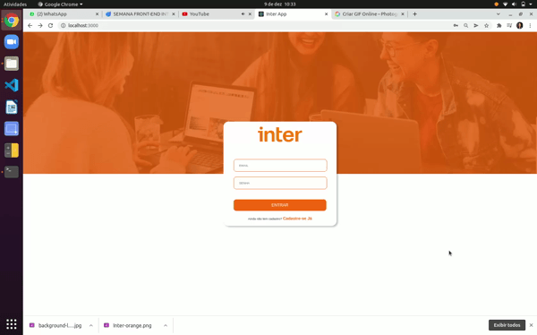

Página criada no desafio da Inter Week da DIO.
Clone da aplicação do Banco Inter.

# Como executar
Clone este repositório:
$ git clone https://github.com/thaygrance/rickandmortyfavorites.git

Acesse a pasta do projeto no seu terminal:
$ cd rickandmortyfavorites

Instale as dependências:
$ yarn install

Execute a aplicação:
$ yarn start
